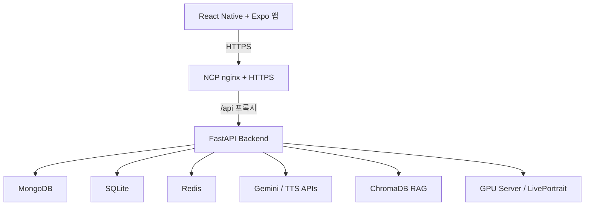

# 🌈 Rainbow Bridge

> 반려동물의 시한부 선고부터 이별 이후 회복까지, 보호자의 감정 기록·추모 콘텐츠·일상 복귀를 이어주는 **AI 펫로스 케어 서비스**

[]()
[]()
[]()
[]()
[]()


---

## 한눈에 보기

| 항목 | 내용 |
|---|---|
| 프로젝트 | AI 기반 펫로스 애프터케어 서비스 |
| 기간 | 2026.06.01 ~ 2026.06.19 |
| 팀 | 6인 팀 프로젝트 |
| 내 역할 | **팀장 / PM / 백엔드 / API 설계 / 서버 운영 / 회복 게이트 구현** |
| 핵심 흐름 | 프로필 등록 → 감정 체크인 → AI 추모 메시지/TTS → 회복 미션 → 타임라인/리포트 |
| 결과 | 프로토타입 8개 기능 완성, 멀티모달 기능 4개 완성, 최종 발표 시연 완료 |

---

## 문제 정의

반려동물과의 이별은 단순한 슬픔을 넘어 보호자의 생활 리듬, 죄책감, 불안, 사회적 고립과 연결됩니다. 특히 시한부 선고 이후에는 남은 시간을 어떻게 기록할지, 장례를 어떻게 준비할지, 이후 감정을 어떻게 회복할지 보호자가 혼자 판단해야 합니다.

**Rainbow Bridge**는 이별 직후의 위로 문구만 제공하는 서비스가 아니라, 시한부 선고 시점부터 사후 회복까지 이어지는 하나의 케어 흐름을 목표로 설계했습니다.

---

## 서비스 흐름

| 단계 | 사용자가 겪는 상황 | 서비스가 제공하는 것 |
|---|---|---|
| 생전 준비 | 시한부 선고, 남은 시간에 대한 불안 | 프로필·추억·버킷리스트 기록 |
| 이별/장례 | 장례 절차와 선택지에 대한 혼란 | 장례 절차 안내, 안심 문구 |
| 사후 회복 | 죄책감·우울감·일상 복귀 어려움 | 감정 체크인, 추모 메시지, 회복 미션, 리포트 |
| 추억 보관 | 기억을 정리하고 다시 꺼내보고 싶은 욕구 | 타임라인, 편지, TTS, GIF, 슬라이드쇼, 발화 영상 |

---

## 내 기여

### PM / 팀장

- 6인 팀 역할 분담 및 개발 우선순위 조정
- 수의사 웹, PERSO 아바타, 능동 알림 등 범위가 커지는 기능을 축소하고 핵심 시연 플로우 중심으로 재정렬
- 서비스 프레임을 `생전 → 이별/장례 → 사후 회복 → 추억 보관` 흐름으로 정리
- 최종 발표용 시나리오, 데모 계정, 기능 완성 기준 관리

### Backend / API

- FastAPI 기반 주요 API 설계 및 구현
- MongoDB, SQLite, Redis 연동 구조 정리
- 감정 체크인, 메시지, 미션, 타임라인, 미디어, 리포트 흐름 통합
- 데모 계정 6개와 시나리오 데이터를 자동 생성하는 seed 스크립트 운용

### Recovery Logic / 운영

- 감정 체크인 기반 안전 라우팅 흐름 적용
- `recovery_score` 기반 콘텐츠 해금 구조 설계
- GIF → 3인칭 편지 → 1인칭 편지 → 전체 패키지 순차 해금 흐름 반영
- NCP 서버 배포, Docker Compose 실행 환경, GitHub Actions CI 흐름 운용

---

## 핵심 기능

| # | 기능 | 설명 | 상태 |
|---|---|---|---|
| 1 | 반려동물 프로필 입력 | 이름, 종, 함께한 기간, 추억, 버킷리스트 기록 | ✅ |
| 2 | 보호자 감정 체크인 | 현재 감정 기록 및 안전 라우팅 | ✅ |
| 3 | 기억 기반 추모 메시지 | Gemini 기반 개인화 위로 메시지 생성 | ✅ |
| 4 | TTS 음성 낭독 | 추모 편지 음성 합성 및 폴백 구조 | ✅ |
| 5 | 일상 복귀 미션 | 회복 단계별 행동 미션 추천 | ✅ |
| 6 | 추모 타임라인 | 감정, 메시지, 미션, 사진 기록 저장 | ✅ |
| 7 | 회복 평가 리포트 | 감정 추이, 미션 완료율, 생활 패턴 시각화 | ✅ |
| 8 | 콘텐츠 해금 | 회복 점수 기반 편지·GIF·영상 순차 해금 | ✅ |

### 멀티모달 가산 기능

| 기능 | 설명 | 상태 |
|---|---|---|
| 사진 → 발화 영상 | 반려동물 사진 + TTS + LivePortrait 기반 MP4 생성 | ✅ |
| 슬라이드쇼 영상 | 업로드 사진 자동 편집 및 BGM 합성 | ✅ |
| GIF 생성 | 회복 보상 아이템으로 제공 | ✅ |
| 단계별 콘텐츠 해금 | recovery_score 기반 순차 해금 | ✅ |

---

## 성과 지표

| 지표 | 결과 | 목표 | 판정 |
|---|---:|---:|---|
| 안전 라우팅 골든셋 | **40/40, 100%** | 90% 이상 | ✅ |
| G-Eval 대화 품질 | **4.76 ~ 4.83 / 5.0** | 4.0 이상 | ✅ |
| G-Eval 윤리 준수 | **4.61 / 5.0** | 4.0 이상 | ✅ |
| TTS CER — 3인칭 편지 | **1.0%** | 10% 이하 | ✅ |
| TTS CER — 1인칭 편지 | **5.5%** | 10% 이하 | ✅ |
| 립싱크 상관계수 | **0.896** | 0.7 이상 | ✅ |
| 립싱크 지연 | **+40ms** | ±100ms | ✅ |

상세 평가 리포트: [docs/AI휴먼_정량평가_리포트.md](docs/AI휴먼_정량평가_리포트.md)

---

## 기술 스택

| 영역 | 기술 |
|---|---|
| Backend | FastAPI, Python 3.13, Pydantic |
| Database | MongoDB, SQLite, Redis |
| Frontend | React Native, Expo SDK 54 |
| AI / LLM | Gemini 2.5 Flash |
| RAG | ChromaDB |
| TTS | WaveSpeedAI → Qwen3 GPU → Google Cloud TTS → gTTS 폴백 |
| Multimodal | LivePortrait, FFmpeg, GPU 서버 |
| Infra | NCP Cloud Server, Docker Compose, GitHub Actions, nginx, HTTPS |

---

## 시스템 아키텍처



자세한 구조: [docs/ARCHITECTURE.md](docs/ARCHITECTURE.md)

---

## 실행 방법

```bash
cp .env.example .env

docker compose up -d --build

docker compose logs -f backend
```

API 문서:

```bash
http://localhost:8000/docs
```

데모 데이터 시드:

```bash
docker exec rainbow_backend python scripts/seed_scenario.py
```

프론트엔드 실행:

```bash
cd frontend-rn
npm install
echo "EXPO_PUBLIC_API_URL=http://YOUR_LOCAL_IP:8000" > .env
npx expo start
```

> 프로토타입 발표 이후 실서버 운영은 중단했습니다. 로컬 실행은 위 가이드를 기준으로 확인할 수 있습니다.

---

## 폴더 구조

```text
rainbow-bridge/
├── backend/        # FastAPI 백엔드
├── frontend-rn/    # React Native + Expo 앱
├── ai/             # LLM, TTS, LivePortrait, evaluation
├── docs/           # 설계 문서, 평가 리포트, 회의록, 개발일지
├── docker-compose.yml
└── .env.example
```

---

## 팀 구성

| 이름 | 역할 | 주요 기여 |
|---|---|---|
| 모세종 | PM + 백엔드 | API 설계·구현, 회복 게이트, 서버 운영, CI/CD |
| 김윤한 | 백엔드 / 인프라 | HTTPS·도메인, Docker 통합, 타임라인 API |
| 반소람 | AI 엔지니어 | LLM 프롬프트, RAG, 안전 라우팅, 평가 지표 |
| 정환주 | AI 엔지니어 / GPU 서버 | TTS 4단계 폴백, GPU 서버, 평가 리포트 |
| 민경이 | 프론트엔드 | React Native + Expo 앱 화면 구현 |
| 장민수 | 멀티모달 | LivePortrait, 슬라이드쇼, GIF 생성 |

---

## 주요 문서

| 문서 | 설명 |
|---|---|
| [docs/ARCHITECTURE.md](docs/ARCHITECTURE.md) | 시스템 구조 |
| [docs/PROGRESS.md](docs/PROGRESS.md) | 프로토타입 진행도 |
| [docs/RECOVERY_SCORE_DESIGN.md](docs/RECOVERY_SCORE_DESIGN.md) | 회복 지수 설계 |
| [docs/SERVICE_FRAME.md](docs/SERVICE_FRAME.md) | 서비스 범위와 기능 틀 |
| [docs/ETHICS_추모표현_가이드.md](docs/ETHICS_추모표현_가이드.md) | 추모 표현 윤리 가이드 |
| [docs/devlog/README.md](docs/devlog/README.md) | 개발일지 |

---

## 안내

- AI 생성 콘텐츠는 보호자가 제공한 추억을 바탕으로 재해석한 내용임을 명시합니다.
- 본 프로젝트는 교육 과정 내 프로토타입이며, 전문 심리치료나 실제 장례 서비스를 대체하지 않습니다.
