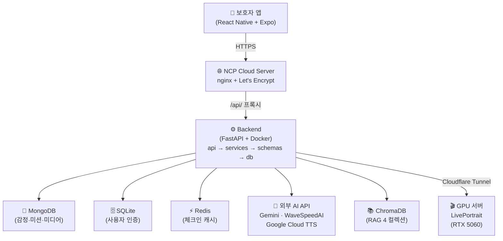

# 🌈 레인보우 브릿지 (Rainbow Bridge)

> 반려동물의 시한부 선고부터 이별·회복까지, **보호자 곁에서 함께하는 AI 케어 서비스**

[]()
[]()
[]()
[]()
[](https://github.com/mosejong/rainbow-bridge/actions)


---

## 📌 서비스 개요

국내 반려동물 양육 인구 **1,546만 명** — 그중 반려동물과 이별을 경험한 보호자의 **83%가 우울감**을 겪고, 16%는 1년 이상 펫로스 증후군을 앓습니다. 그러나 이 시간을 함께 버텨주는 서비스는 없었습니다.

레인보우 브릿지는 수의사의 **시한부 선고** 시점부터 진입해, 남은 시간의 추억 기록 → 장례 안내 → 펫로스 회복까지를 하나의 흐름으로 잇는 AI 케어 서비스입니다.

**비즈니스 모델: 연계형(B2B2C)** — 장례업체·동물병원이 채널·지불자, 보호자는 무료

| 단계 | 우리가 하는 것 | 우리가 안 하는 것 |
|------|----------------|-------------------|
| 생전 | 버킷리스트·사진 기록, 추억 쌓기 | 일반 반려동물 케어 앱 대체 |
| 장례 | 장례 절차 안내·연계 | 직접 장례 서비스 제공 |
| 사후 | AI 추모 메시지·영상·일상 복귀 미션 | 반려동물 부활 / AI 실제 대화 |
| 위기 | 감정 감지 → 1393 즉시 안내 | 전문 심리치료 대체 |

> **온보딩 카피:** "아이가 강아지별로 이사를 준비하고 있어요. 남은 시간동안 가서도 행복하게 좋은 추억 만들어 보아요."

---

## ✨ 핵심 기능

### 프로토타입 8개 기능 (전부 완성)

| # | 기능 | 설명 | 상태 |
|---|------|------|------|
| ① | 반려동물 프로필 입력 | 이름·종·함께한 기간·추억·버킷리스트 등 | ✅ |
| ② | 보호자 감정 체크인 | 오늘의 감정 상태 기록 + 위기 감지 (L0~L3) | ✅ |
| ③ | 기억 기반 추모 메시지 생성 | Gemini AI 개인화 위로 메시지 (RAG 기반, 가드레일 적용) | ✅ |
| ④ | TTS 음성 낭독 | WaveSpeedAI 메인 + 3단계 폴백, warm·calm·hopeful 톤 | ✅ |
| ⑤ | 일상 복귀 미션 추천 | 회복 단계별 행동 미션 (LLM+RAG, difficulty 3단계) | ✅ |
| ⑥ | 추모 타임라인 저장 | 감정·메시지·미션·사진 기록 시간순 보관 | ✅ |
| ⑦ | 위기 감정 안전 라우팅 | risk_level L0~L3, L2↑ → 1393 즉시 안내 | ✅ |
| ⑧ | 회복 평가 리포트 | 감정 추이·미션 완료율·생활패턴 시각화, 4축 회복 지수 | ✅ |

### 멀티모달 가산점 기능

| 기능 | 설명 | 상태 |
|------|------|------|
| 사진 → 발화 영상 (LivePortrait) | 반려동물 사진에 1인칭 편지 TTS 합성 → MP4 | ✅ |
| 슬라이드쇼 영상 생성 | 업로드 사진 자동 편집 → BGM 합성 MP4 | ✅ |
| GIF 생성 | 회복 보상 아이템, 미션 20점 달성 시 해금 | ✅ |
| 단계별 콘텐츠 해금 (회복 게이트) | recovery_score 기반 순차 해금 (GIF→3인칭→1인칭→패키지) | ✅ |

### AI 케어 모듈

| 모듈 | 설명 | 상태 |
|------|------|------|
| 수의사 처치 안내 RAG | 기본 대처법 + 내원 유도 | ✅ |
| 장례 절차 상담 RAG | 장례 절차·방법 Q&A | ✅ |
| 기념일 케어 | D+30·D+100 자동 메시지 | ✅ |

> 상세 진행 상황: [docs/PROGRESS.md](docs/PROGRESS.md)

---

## 🧱 기술 스택

| 영역 | 기술 |
|------|------|
| Backend | FastAPI (Python 3.13), MongoDB, SQLite, Redis |
| Frontend | React Native + Expo SDK 54 (Android/iOS) |
| AI / LLM | Gemini API (`gemini-2.5-flash`) |
| RAG | ChromaDB (comfort · mission · funeral · vet_protocol) |
| TTS | WaveSpeedAI (메인) → Qwen3 GPU → Google Cloud TTS → gTTS (4단계 폴백) |
| 멀티모달 | LivePortrait (GPU 서버, RTX 5060), FFmpeg |
| Infra | NCP Cloud Server, Docker Compose, GitHub Actions CI/CD |
| 보안 | Let's Encrypt HTTPS, DuckDNS, Cloudflare Tunnel (GPU) |

자세한 구조: [docs/ARCHITECTURE.md](docs/ARCHITECTURE.md)

---

## 🏆 핵심 성과 지표

> 3주 프로토타입 기간(2026-06-01 ~ 06-19) 자체 측정 기준

| 지표 | 결과 | 목표 | 판정 |
|------|------|------|------|
| 위기 감지 정확도 (골든셋 40건) | **100%** (40/40) | ≥ 90% | ✅ |
| G-Eval 대화 품질 (일관성·유용성·자연스러움) | **4.76 ~ 4.83 / 5.0** | ≥ 4.0 | ✅ |
| G-Eval 윤리 준수 | **4.61 / 5.0** | ≥ 4.0 | ✅ |
| TTS CER — 3인칭 편지 | **1.0%** | ≤ 10% | ✅ |
| TTS CER — 1인칭 편지 | **5.5%** | ≤ 10% | ✅ |
| 립싱크 상관계수 (동물 아바타 기준) | **0.896** | ≥ 0.7 | ✅ |
| 립싱크 지연 | **+40ms** | ±100ms | ✅ |

상세 평가 리포트: [docs/AI휴먼_정량평가_리포트.md](docs/AI휴먼_정량평가_리포트.md)

---

## 🔧 기술적 도전

### 1. 동물 얼굴 립싱크 — SyncNet 사용 불가 문제
기존 립싱크 평가 지표(SyncNet, LSE)는 사람 얼굴 전용 모델로 동물 아바타에 적용 불가. **입 벌림 keypoint ↔ 오디오 RMS 상관계수/지연** 방식을 직접 설계해 동물 전용 평가 지표로 대체.

### 2. 위기 감정 안전 라우팅
LLM 응답 생성 전 별도 safety 레이어(L0~L3)를 통과시키는 이중 구조 설계. L2 이상 감지 시 콘텐츠 생성 차단 + 1393 즉시 안내. 골든셋 40건 전수 통과.

### 3. TTS 감정 표현 품질
Google Cloud TTS 기본 톤으로는 감정선 부재 문제 → LLM 히든 워드(감정 지시어)를 프롬프트에 주입해 warm·calm·hopeful 3단계 톤 분화 구현. 4단계 폴백(WaveSpeedAI → Qwen3 → Google → gTTS)으로 장애 내성 확보.

### 4. 회복 게이트 설계
단순 점수 임계값이 아닌 **체크인 이력 전체 구간 분석** 방식 채택. recovery_score(0~100) 기반 콘텐츠 순차 해금(GIF→3인칭→1인칭→패키지), 1인칭 콘텐츠는 최근 체크인 전체 risk=0 조건 충족 시에만 노출.

---

## 🗺️ 시스템 아키텍처



---

## 🚀 통합 실행 방법

### 사전 요구사항

- Docker & Docker Compose v2.x 이상
- Python 3.13+ (로컬 개발 시)
- Node.js 18+ (프론트 로컬 개발 시)

### 1. 환경 변수 설정

```bash
cp .env.example .env
```

`.env` 필수 항목:

```env
# AI API
GEMINI_API_KEY=your_gemini_api_key

# DB
MONGO_URI=mongodb://mongodb:27017
MONGO_DB_NAME=rainbow_bridge
SQLITE_DB_PATH=/app/backend/data/rainbow_bridge.db
REDIS_URL=redis://redis:6379

# TTS (선택 — 없으면 gTTS 폴백 사용)
WAVESPEED_API_KEY=your_wavespeed_key
GOOGLE_APPLICATION_CREDENTIALS=/app/backend/credentials.json

# 멀티모달 GPU 서버 (선택)
LIVEPORTRAIT_REMOTE_URL=https://your-cloudflare-tunnel.trycloudflare.com
```

### 2. Docker Compose로 전체 실행 (권장)

```bash
# 전체 빌드 & 실행 (백엔드 + MongoDB + Redis)
docker compose up -d --build

# 로그 확인
docker compose logs -f backend

# API 문서 접속
# http://localhost:8000/docs
```

### 3. 서비스 상태 확인

```bash
# 헬스체크
curl http://localhost:8000/health

# 컨테이너 상태
docker compose ps
```

### 4. 시연 데이터 시드

```bash
# 데모 계정 6개 + 시나리오 데이터 자동 생성
docker exec rainbow_backend python scripts/seed_scenario.py
```

| 계정 | 시나리오 |
|------|----------|
| demo00@demo.com | locked — 이별 4일차, 회복 전 비교용 |
| demo01@demo.com | teaser — 회복 진행 중, 삼성헬스 리포트 |
| demo02@demo.com | open — 3인칭 편지·GIF 해금 |
| demo03@demo.com | open — 슬라이드쇼 영상 해금 |
| demo04@demo.com | open — 1인칭 편지 + LP 발화 영상 |
| demo05@demo.com | teaser — 20일차 회복, 비교용 |
| super@super.com | **전체 기능 해금** — 데모용 (score 94) |

> 비밀번호는 시드 스크립트(`scripts/seed_scenario.py`) 실행 후 확인하세요.

### 5. 프론트엔드 (로컬 개발)

```bash
cd frontend-rn
npm install

# .env 설정
echo "EXPO_PUBLIC_API_URL=http://YOUR_LOCAL_IP:8000" > .env

npx expo start   # Expo Go 앱으로 QR 스캔
```

### 6. 백엔드 단독 실행 (로컬 개발)

```bash
cd backend
pip install -r requirements.txt
uvicorn app.main:app --reload   # http://localhost:8000/docs
```

### 7. push 전 CI 자동 검사

```bash
cd backend && ruff check . --fix && black . && pytest -q
```

> ⚠️ 프로토타입 발표(2026-06-19) 종료 후 서버 운영이 중단되었습니다. 로컬 실행 방법은 위 가이드를 참고하세요.

---

## 📁 폴더 구조

```
rainbow-bridge/
├── backend/                  # FastAPI 백엔드
│   ├── app/
│   │   ├── api/              # 라우터 (엔드포인트)
│   │   ├── services/         # 비즈니스 로직
│   │   ├── schemas/          # 요청/응답 스키마 (Pydantic)
│   │   ├── models/           # DB 모델
│   │   └── db/               # DB 연결 (MongoDB, Redis, SQLite)
│   ├── scripts/              # 시드·운영 스크립트
│   └── tests/                # pytest 테스트
├── frontend-rn/              # React Native + Expo 앱
│   ├── app/                  # 화면 (Expo Router)
│   ├── api/                  # 백엔드 API 호출
│   └── components/           # 공통 컴포넌트
├── ai/                       # AI 엔진
│   ├── llm/                  # 추모 메시지·위기 감지·케어 모듈
│   ├── tts/                  # 음성 합성 (WaveSpeed·Qwen3·Google)
│   ├── liveportrait/         # 사진→영상 파이프라인
│   └── evaluation/           # 평가 리포트·회복 지수 산출
├── docs/                     # 📚 문서
│   ├── ARCHITECTURE.md       # 시스템 구조
│   ├── PROGRESS.md           # 프로토타입 진행도
│   ├── RECOVERY_SCORE_DESIGN.md  # 회복 지수 설계
│   ├── SERVICE_FRAME.md      # 서비스 범위·기능 틀
│   ├── ETHICS_추모표현_가이드.md   # 추모 표현 허용/금지 경계
│   ├── scrum/                # 스크럼 회의록
│   └── devlog/               # 개발일지
├── docker-compose.yml        # 통합 실행 설정
└── .env.example              # 환경 변수 템플릿
```

---

## 👥 팀 구성 및 역할 (팀 2)

| 이름 | 역할 | 담당 영역 | 주요 기여 |
|------|------|-----------|-----------|
| 모세종 | PM + 백엔드 | `backend/` | API 전체 설계·구현, 회복 게이트, 서버 운영, CI/CD |
| 김윤한 | 백엔드 / 인프라 | `backend/`, 인프라 | HTTPS·도메인 구축, Docker 통합, 타임라인 API |
| 반소람 | AI 엔지니어 | `ai/llm/` | LLM 프롬프트, RAG 구축, 위기 감지 로직, 평가 지표 |
| 정환주 | AI 엔지니어 / GPU 서버 | `ai/`, GPU 인프라 | TTS 파이프라인(4단계 폴백), GPU 서버 운영, 평가 리포트 |
| 민경이 | 프론트엔드 | `frontend-rn/` | 전체 앱 화면 구현 (React Native + Expo) |
| 장민수 | 멀티모달 | `ai/liveportrait/` | LivePortrait 파이프라인, 슬라이드쇼·GIF 생성 |


---

## 📊 개발 지표

| 항목 | 수치 |
|------|------|
| 총 커밋 수 | 1,439+ |
| 머지된 PR 수 | 365+ |
| API 엔드포인트 | 40+ |
| 테스트 커버리지 | 핵심 서비스 pytest 적용 |
| 프로토타입 기능 완성률 | 8/8 (100%) |
| 멀티모달 가산 기능 완성률 | 4/4 (100%) |

---

## 📅 개발 일정

| 기간 | 내용 |
|------|------|
| 2026-06-01 | 프로젝트 시작, 레포 셋업, 기술 스택 확정 |
| 2026-06-02 | 팀 역할 분담, 서비스 기획 회의, 아키텍처 초안 |
| 2026-06-03 | LLM(Gemini) 실연동, FastAPI 뼈대 완성 |
| 2026-06-04 | DB 스키마 설계, 감정 체크인 API 초안 |
| 2026-06-05 | NCP 실서버 배포, Redis 캐시, E2E 첫 완주 |
| 2026-06-06 | 추모 메시지 생성 API, RAG 컬렉션 초기 구축 |
| 2026-06-07 | 프론트엔드 화면 기초 구현, 백엔드 연동 테스트 |
| 2026-06-08 | 서비스 방향 확정 (B2B2C, 시한부 진입점), 수의사 웹 드랍 |
| 2026-06-09 | 위기 감지 로직 개선, 1인칭 표현 가이드라인 확정 |
| 2026-06-10 | 중간 진도 점검, 갭 분석, RAG 미션·장례 컬렉션 구축 |
| 2026-06-11 | 미션 추천 API, 타임라인 저장 API, 회복 지수 설계 |
| 2026-06-12 | LivePortrait GPU 서버 연동, Docker Compose 통합 |
| 2026-06-13 | LivePortrait 파이프라인 구축, GIF·슬라이드쇼 생성 |
| 2026-06-14 | TTS 4단계 폴백 완성, WaveSpeedAI 메인 전환 |
| 2026-06-15 | 회복 게이트 4축 산식 확정, 리포트 API 완성 |
| 2026-06-16 | 전체 E2E 통합 테스트, 데모 계정 시드 |
| 2026-06-17 | TTS 감정 튜닝, G-Eval 평가 실행, 립싱크 정량 측정 |
| 2026-06-18 | 데모 계정 정상화, 평가 리포트 작성, 발표 자료 완성 |
| 2026-06-19 | **최종 발표** |

---

## 🔗 산출물 링크

| 항목 | 링크 |
|------|------|
| ~~실서버 (앱)~~ | ~~https://rainbow-bridge.duckdns.org~~ (서버 종료) |
| ~~API 문서 (Swagger)~~ | ~~https://rainbow-bridge.duckdns.org/api/docs~~ (서버 종료) |
| 회복 지수 설계 | [docs/RECOVERY_SCORE_DESIGN.md](docs/RECOVERY_SCORE_DESIGN.md) |
| 서비스 범위 기획 | [docs/SERVICE_FRAME.md](docs/SERVICE_FRAME.md) |
| 윤리 가이드라인 | [docs/ETHICS_추모표현_가이드.md](docs/ETHICS_추모표현_가이드.md) |
| 개발일지 | [docs/devlog/README.md](docs/devlog/README.md) |

---

## 📜 안내

- AI 생성 콘텐츠는 "AI가 보호자가 전해준 추억을 바탕으로 재해석한 내용"임을 명시합니다.
- 위기 감정 안내 번호 **1393**은 임의로 변경하지 마세요.
- 상세 윤리 기준: [docs/ETHICS_추모표현_가이드.md](docs/ETHICS_추모표현_가이드.md)
