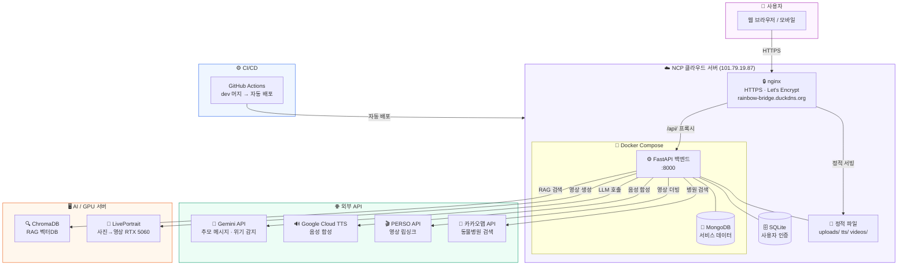

# 시스템 구성도 — 레인보우 브릿지

> System Architecture · 발표용 인프라 구성도

## 인프라 현황

| 구성 요소 | 기술 | 상태 |
|-----------|------|------|
| 클라우드 서버 | NCP Ubuntu 24.04 | ✅ 운영 중 |
| HTTPS | DuckDNS + Let's Encrypt | ✅ |
| 컨테이너 | Docker Compose | ✅ |
| 자동 배포 | GitHub Actions (dev → NCP) | ✅ |
| LLM | Gemini API (gemini-2.5-flash) | ✅ |
| TTS | Google Cloud TTS + gTTS 폴백 | ✅ |
| RAG | ChromaDB + Gemini 임베딩 | ✅ |
| 영상 생성 | LivePortrait (RTX 5060) | 🟡 서버 설정 중 |
