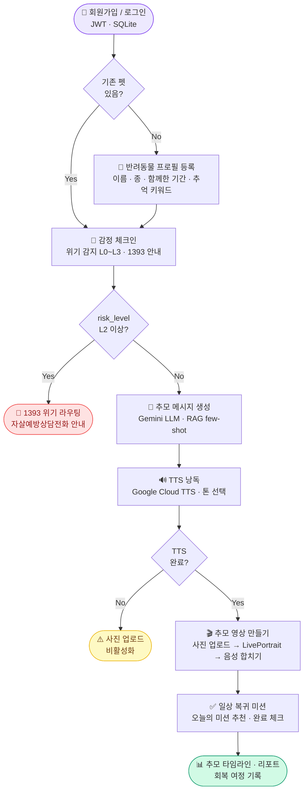

# 사용자 흐름도 — 레인보우 브릿지

> User Flow · 발표용 플로우차트

## 핵심 분기

| 분기 | 조건 | 결과 |
|------|------|------|
| 기존 펫 있음 | 로그인 후 GET /pets 확인 | 감정 체크인 바로 이동 |
| 위기 감지 L2+ | risk_level ≥ 2 | 1393 즉시 안내, 메시지 생성 중단 |
| TTS 미완료 | tts_done localStorage 없음 | 사진 업로드 버튼 비활성화 |
