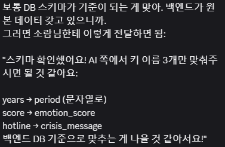

# 개발일지 — 반소람 (AI 엔지니어)

> 최신 날짜를 **맨 위**에 추가하세요. 통합 일지: [../README.md](../README.md)
>
> <details><summary>📋 작성 템플릿 (복사해서 사용)</summary>
>
> ```markdown
> ## YYYY-MM-DD (Day N)
> ### 오늘의 목표
> -
> ### 한 일
> - [x]
> ### 막힌 것 / 고민
> -
> ### 내일 할 일
> - [ ]
> ```
> </details>

---

## 2026-06-03 — provider(Gemini) 연동 (추가)

### 한 일 (무엇이 바뀌었나)
- [x] **`provider.py` 신규** — LLM 호출 추상화. OpenAI 호환 방식으로 Gemini 연결
  (`generate(prompt, *, max_tokens, temperature, json_mode)`), 재시도·타임아웃·예외 graceful
- [x] **`config.py` 신규** — `.env` 기반 설정(provider/base_url/model/key/타임아웃/재시도/토큰/온도)
- [x] **thinking 제어 추가** — `gemini-2.5-flash`는 thinking 기본 ON이라 답변이 잘림 →
  `reasoning_effort="none"`(config `LLM_REASONING_EFFORT`)으로 꺼서 해결
- [x] **`tests/test_provider.py` 신규** — 응답·오버라이드·json_mode·thinking·재시도·키누락 10종
- [x] **`memorial`이 실제 동작 확인** — `generate=provider.generate` 주입 →
  실제 Gemini로 봄이·초코 위로 메시지 생성, 위기 입력은 1393 우선, 부활 출력 차단까지 라이브 검증
- [x] **백엔드 API 스키마 합의·반영** — 리뷰 피드백 반영해 입출력 키를 백엔드 DB 기준으로 정렬
  - `years`(숫자) → **`period`**(문자열), `score` → **`emotion_score`**, 출력 `hotline` → **`crisis_message`**
  - 출력이 백엔드 `MessageResponse`(content·tone·source·risk_level·crisis_message)와 일치 → 모세종님이 stub을 `generate_message` 호출로 교체만 하면 연동 완료
- [x] 전체 테스트 84종 통과 / ruff·black 통과

### 결정 사항
- 엔진: **Gemini API**(OpenAI 호환 엔드포인트, `gemini-2.5-flash`). 로컬 EXAONE은 폴백
- `.env`에 Gemini 설정 채움 — **키는 로컬만**(`.gitignore`로 커밋 제외)
- ③ 입출력 키 = 백엔드 DB 스키마 기준(`pet.period`·`emotion_score`·`crisis_message`) — 백엔드팀 합의

### 막힌 것 / 고민
- Gemini 정식 확정은 골든셋(1인칭 회피·위기 미탐 0) 통과 확인 후 — 1인칭은 3샘플 통과, ⑦ LLM 분류 레이어에서 정식 검증 예정
- 톤 키(warm·calm·hopeful)가 정환주님 TTS 톤과 동일 → ③↔④ 값 합의 필요

### 다음 할 일
- [ ] ⑤ 미션 추천(`mission.py`) 또는 백엔드 ③ API 연동 협의

---

## 2026-06-02 (Day 2)

**컨디션:** AI 파트 본격 착수 🟨

### 오늘의 목표
- 위기 감정 감지(⑦) 규칙 레이어 고도화 + 골든 테스트셋 구축
- 추모 메시지(③) 프롬프트 초안 작성 + 생성 로직 흐름 잡기

### 한 일
- [x] **⑦ 위기 감지 규칙 고도화** — `safety.py` 규칙 레이어(L0)
  - 표현 대상(subject: self/pet/other) 구분으로 오탐 방지 ("봄이가 죽었어요"=정상 L0)
  - 본인 욕구 어법("~고 싶다") 신호 사전 + 맥락 점수(시제·부정·강도) 보정
  - 골든 테스트셋으로 미탐 0 회귀 검증, `CRISIS_HOTLINE`(1393) 상수화
- [x] **③ 추모 메시지 프롬프트 초안** — `prompts/memorial.py`
  - 시스템 프롬프트에 윤리 경계(반려동물 1인칭·부활 금지) 명시
  - 톤 3종(warm·calm·hopeful, TTS 톤 매핑 대비), 추억 키워드 자동 삽입
  - `build_user_prompt` / `build_messages` (system+user)
- [x] **③ 추모 메시지 생성 로직** — `memorial.py` `generate_message()`
  - 흐름: 위기 선체크 → 프롬프트 조립 → LLM 호출(주입) → 후처리 가드
  - 위기 신호(L2↑) 시 메시지 대신 1393 안내 우선
  - 부활/1인칭 출력 차단·재생성(`GuardrailViolation`)
- [x] **테스트** — `tests/test_memorial.py` 10종(프롬프트 조립·흐름·안전·가드), 전체 74종 통과

### 결정 사항
- `provider.generate`를 **의존성 주입**으로 비워둠 → 엔진 확정 전 가짜 모델로 흐름·가드 검증, 확정 후 그대로 꽂기
- 프롬프트는 코드와 분리해 `prompts/`에서 버전 관리 (팀 규칙)

### 막힌 것 / 고민
- **provider.py 미구현** — 진짜 LLM 호출은 선행결정 A(엔진/모델)·B(통합 방식)가 정해져야 가능. **정환주님과 협의 + GPU 서버(RTX 5060) 셋업** 필요
- ③ 메시지 "품질"(실제 위로 톤·1인칭 안 나오는지)은 모델 연결 후에야 검증 가능

### 내일 할 일
- [ ] PERSO API 문서 확인 (0-6) — 입/출력 형식·인증·할당량 파악
- [ ] 정환주님과 로컬 LLM 엔진/모델(결정 A)·통합 방식(결정 B) 협의
- [ ] 위 작업 `bansoram` → `dev` PR
