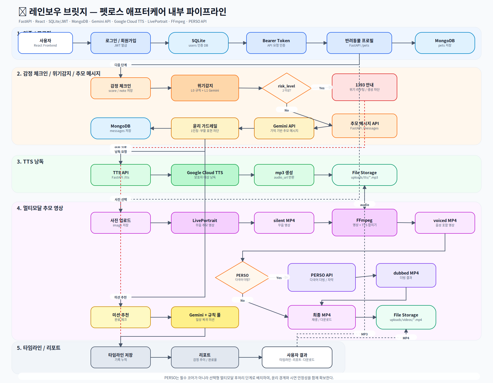

# 스크럼 — 2026-06-05 (Day 5)

> 진행: 모세종 | 참석: 전원

## 🗺️ 서비스 파이프라인

> PERSO는 핵심 코어가 아니라 선택적 멀티모달 후처리 단계로 배치 — 윤리 경계와 영상 완성도를 함께 확보.

---

## 🔁 강사님 피드백 반영 현황 (6/4 스크럼)

| 피드백 | 반영 여부 | 내용 |
|--------|-----------|------|
| 로그인 인증 RDB 필요 | ✅ | SQLite(인증) + MongoDB(서비스) 하이브리드 운영 중 |
| RAG 공통 필수 | ✅ | ChromaDB RAG 배관 구축 완료 (정환주, PR #79) |
| PERSO 립싱크 검증 | ✅ | 동물 얼굴 립싱크 가능 확인 (장민수, AB_compare.mp4) |

---

## 📊 오늘 진행도

| 파트 | 담당 | 오늘 한 것 | 상태 |
|------|------|-----------|------|
| 백엔드 | 모세종 | JWT 인증 전 엔드포인트 적용, IDOR 수정, PERSO 더빙 파이프라인, bcrypt 수정, Mixed Content 해결, UX 플로우 순서 강제 | ✅ |
| 백엔드/인프라 | 김윤한 | Docker 컨테이너화, docker-compose 통합, L1 위기감지 LLM 연동, HTTPS nginx 구축 | ✅ |
| AI | 반소람 | 증상 진료 안내(triage) 4단계, 장례 절차 상담(funeral) 5단계 구현, RAG few-shot memorial 연결 | ✅ |
| AI | 정환주 | ChromaDB RAG 배관 전체 구현 (embeddings·store·ingest·retrieve), Gemini 임베딩 실검증 | ✅ |
| 프론트 | 민경이 | SymptomsPage 병원 카드, HealthRecordsPage, FuneralPage 구현, bcrypt 에러 처리 | ✅ |
| 멀티모달 | 장민수 | LivePortrait+TTS merge_audio 완성, 말하는 driving 영상 A/B 비교 제작, driving 경로 환경변수화 | ✅ |

---

## ✅ MVP 현황 (8개 항목)

| MVP | 백엔드 | AI | 프론트 | 연결 |
|-----|--------|-----|--------|------|
| ① 반려동물 프로필 | ✅ | - | ✅ | ✅ |
| ② 감정 체크인 | ✅ | ✅ L0+L1 위기감지 | ✅ | ✅ |
| ③ 추모 메시지 | ✅ | ✅ RAG few-shot | ✅ | ✅ |
| ④ TTS 음성 | ✅ GCP+gTTS폴백 | ✅ | ✅ | ✅ |
| ⑤ 일상 복귀 미션 | ✅ | ✅ | ✅ | ✅ |
| ⑥ 추모 타임라인 | ✅ | - | ✅ | ✅ |
| ⑦ 안전(1393) | ✅ | ✅ 5단계 검증 | ✅ | ✅ |
| ⑧ 평가 리포트 | ✅ build_report 연결 | ✅ | ✅ | ✅ |

**+ 가산점 멀티모달**

| 파트 | 상태 | 비고 |
|------|------|------|
| 사진 업로드 API | ✅ | 인증·검증 포함 |
| LivePortrait 파이프라인 | ✅ | animals 모드, driving 영상 환경변수화 |
| TTS 음성 합치기 | ✅ | voiced_url 생성 |
| PERSO 립싱크 | ⬜ | voiced_url→PERSO 파이프라인 미검증 |

---

## 🐾 멀티모달 영상 현황

**오늘 확인한 것:**
- `perso_input_dog2.mp4` — LivePortrait driving video 기반 입 움직임 영상 (말하는 driving 소스 사용)
- `AB_compare.mp4` — 사람/고양이 동시 비교 영상 (LivePortrait 결과)
- **PERSO 립싱크(voiced_url → PERSO → dubbed_url) 파이프라인은 미검증**

**멀티모달 파이프라인 현황:**
| 단계 | 상태 |
|------|------|
| 사진 → LivePortrait 무음 영상 | ✅ |
| TTS 음성 생성 | ✅ |
| FFmpeg 음성 합치기 (voiced_url) | ✅ |
| PERSO 립싱크 (voiced_url → dubbed_url) | ⬜ 미검증 |

**다음 단계:** voiced_url → PERSO 립싱크 API 실연동 검증 필요

---

## 🏗️ 인프라 현황

| 항목 | 상태 | 비고 |
|------|------|------|
| NCP 서버 | ✅ | 101.79.19.87 |
| HTTPS | ✅ | rainbow-bridge.duckdns.org (Let's Encrypt) |
| nginx 프록시 | ✅ | `/api/` → localhost:8000 |
| Docker compose | ✅ | MongoDB + Backend 컨테이너화 |
| GCP TTS 키 | ✅ | 서버 적용 완료 |
| GitHub Actions 자동배포 | ✅ | dev 머지 시 자동 빌드·배포 |

---

## ❓ 논의 안건 (강사님께)

1. **RDB PostgreSQL 전환 필요한가?**
   - 현재: SQLite(인증·유저) + MongoDB(서비스 데이터) 하이브리드
   - 지난 스크럼에서 Postgres 언급 — 전환 범위 및 우선순위 확인 필요

2. **RAG 코퍼스 범위**
   - 배관(ChromaDB) 완성, 실제 위로글 코퍼스는 미작성
   - 샘플 5개로 데모 가능한지, 실 데이터 필요한지 확인

3. **PERSO 립싱크 발표 전략 동의 여부**
   - "기술 가능 → 윤리적 이유로 제한" 서사 괜찮은지

---

## 📅 다음 스크럼까지 목표

- [ ] 반소람: 실 위로글 코퍼스 작성 → RAG ingest
- [ ] 장민수: driving 영상 서버 업로드 → LivePortrait 서버 실행
- [ ] 전체: E2E 시연 시나리오 1회 완주 (회원가입→추모 메시지→TTS→영상)
- [ ] 모세종: 발표 시나리오 스크립트 초안 작성
